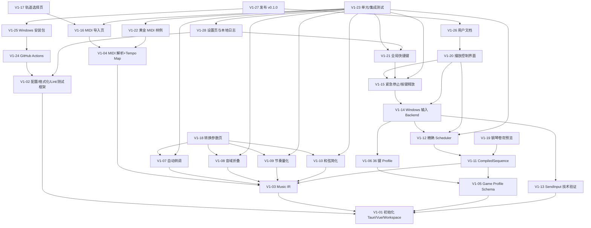

# 依赖关系 DAG — ScoreLeap（谱跃）

> v0.1.0 Issue 依赖图。边含义：`A → B` 表示 A 依赖 B（B 先完成）。
> 创建顺序 = 拓扑序；关键路径：V1-01 → V1-03 → V1-04 → V1-11 → V1-12 → V1-14 → V1-15 → V1-20 → V1-26 → V1-27。



## 拓扑创建顺序（v0.1）

```
V1-01 → V1-02 → V1-03 → V1-05 → V1-04 → V1-06 → V1-13 → V1-07
→ V1-08 → V1-09 → V1-10 → V1-11 → V1-12 → V1-22 → V1-14 → V1-15
→ V1-16 → V1-17 → V1-18 → V1-19 → V1-20 → V1-21 → V1-28 → V1-23
→ V1-24 → V1-25 → V1-26 → V1-27
```

（同一层内可并行开发：V1-03/V1-05 并行；V1-04/V1-06/V1-13 并行；V1-07~V1-10 并行；V1-16~V1-21 中 UI 与 Windows 并行。）

## 并行窗口（多 Agent 调度）

| 窗口 | 可并行 Issue | Agent |
|---|---|---|
| W1 | V1-03（Music IR）、V1-05（Profile Schema） | B、A |
| W2 | V1-04、V1-06、V1-13 | B、B、C |
| W3 | V1-07~V1-10（编排管线） | B |
| W4 | V1-11、V1-12、V1-22 | B |
| W5 | V1-14、V1-15（Windows）、V1-16~V1-19（UI） | C、E |
| W6 | V1-20、V1-21（播放控制/快捷键）、V1-28（设置/日志） | E、C |
| W7 | V1-23~V1-27（质量/发布） | E/F、E |

## 跨版本依赖

- v0.2 依赖 v0.1 的：music-ir、arranger、sequence、scheduler（核心）、game-profile；
- v0.3 依赖 v0.1/v0.2 的：编辑器基于 MusicDocument/CompiledSequence；
- v0.4 依赖 v0.3：转录结果编辑复用编辑器；不依赖 Android；
- v0.5 依赖 v0.4 研究结论。

## 冲突协调规则

- 依赖未完成 → Issue 保持 `status:blocked`，不开始实现；
- 接口冲突 → 暂停相关实现，Agent A 裁决；
- 公共文件 → 见 repository-plan.md §5。
